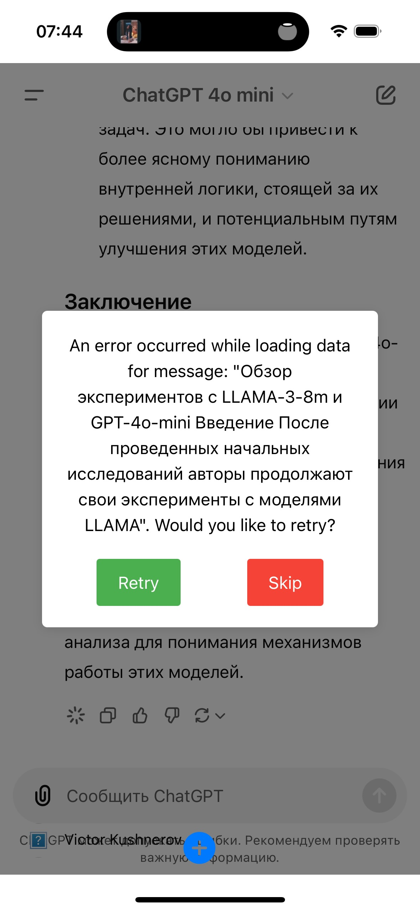
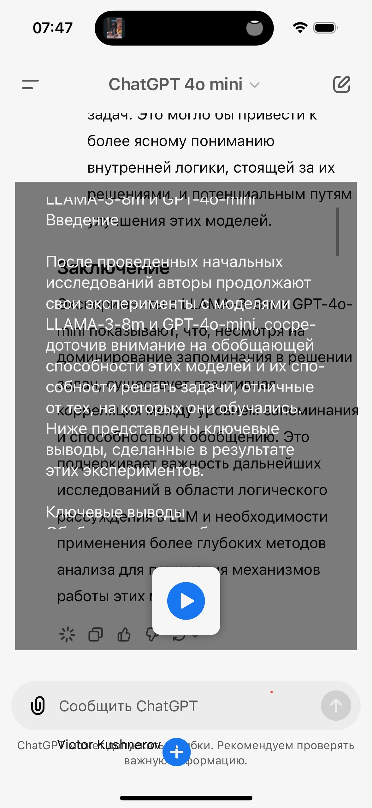
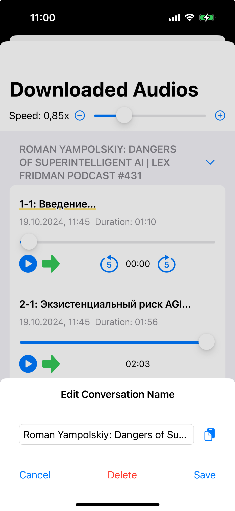

# AudioFetchChatGPT

**AudioFetchGPT** is a powerful iOS application designed for integration with ChatGPT and for managing audio files associated with conversations. The app provides convenient tools for downloading, playing, and organizing voice messages, ensuring users have a seamless experience interacting with AI and audio content.

  
  
  
  
   
  
  

## Key Features

### Automatic Audio File Downloading

- **Voice Message Downloading**: Automatically extract and save audio files from ChatGPT conversations.
- **Download Management**: Ability to confirm the download of each audio file and receive notifications upon completion.

### Audio File Management

- **Play and Pause**: Easily manage audio playback with intuitive controls.
- **Playback Speed Adjustment**: Set playback speed from 0.5x to 2.0x for comfortable listening.
- **Rewind and Fast-Forward**: Quickly skip audio by 5 seconds forward or backward.
- **Rename and Delete**: Rename audio files and delete unnecessary recordings as needed.

### Organizing Audio Files

- **Conversation Grouping**: Audio files are automatically grouped by conversation identifiers for easy access.
- **Edit Conversation Names**: Modify conversation names for better organization.
- **Reordering**: Simple drag-and-drop sorting of audio files.

### WebView Integration

- **Built-in Web Interface**: Use WKWebView to display the ChatGPT interface directly in the app.
- **Conversation Search**: Search conversation text and navigate to specific messages.
- **Message Navigation**: Quickly jump to specific messages within a conversation to play the associated audio files.

### Lock Screen Playback Control

- **Control via Control Center**: Play, pause, and skip audio directly from the lock screen.
- **Playback Information**: Display the current track, playback time, and album artwork.

### Sending Messages

- **From Clipboard**: Send copied text from the clipboard to ChatGPT.
- **From Text File**: Import text files to send to ChatGPT, enhancing interaction capabilities.

### Notifications and Alerts

- **Sound and Vibration Alerts**: Receive audio signals and vibrations upon successful audio file downloads.

