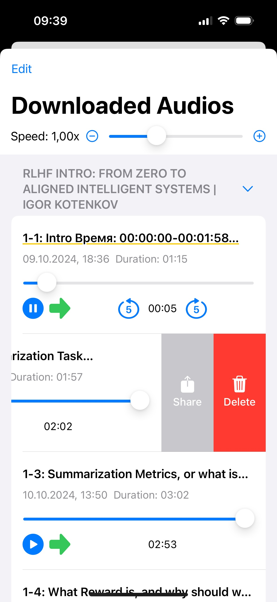
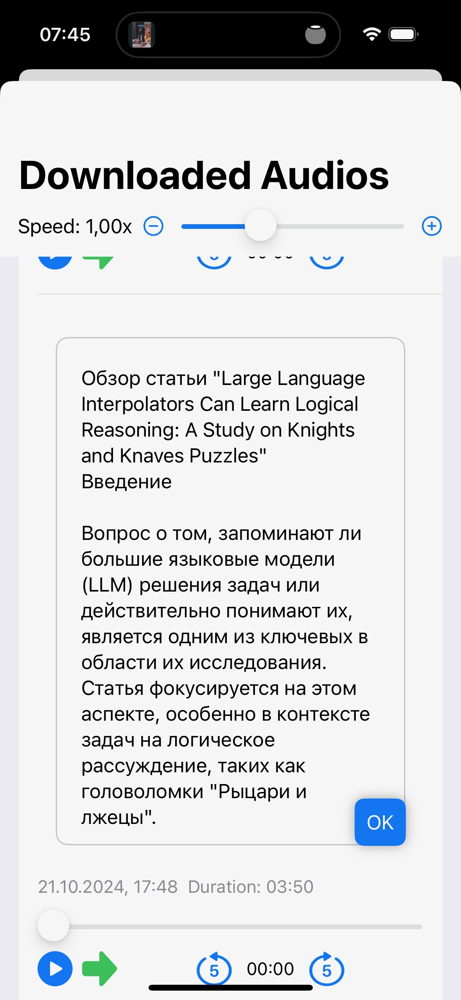
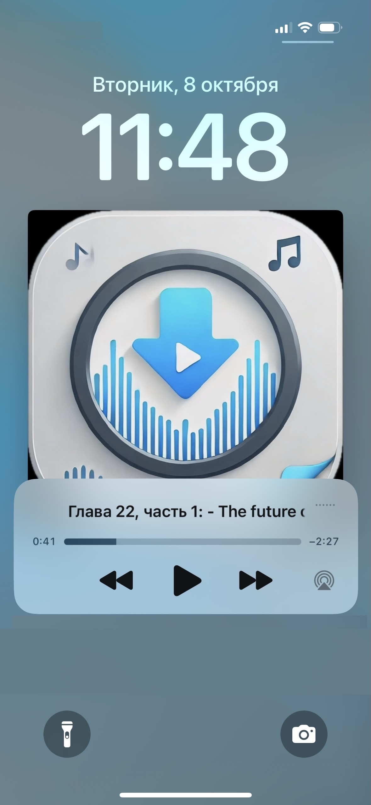

# AudioFetchChatGPT Documentation

## Overview

AudioFetchChatGPT is an iOS application designed to interact with ChatGPT, allowing users to download and manage audio content from conversations. The app provides a web interface to ChatGPT, audio playback capabilities, and a download management system.

  
  
  
  

## Key Features

1. Web Interface: Integrates a WebView to interact with ChatGPT.
2. Audio Download: Captures and downloads audio content from ChatGPT conversations.
3. Audio Playback: Allows users to play, pause, and seek through downloaded audio files.
4. Download Management: Provides a list view of downloaded audio files with editing and deletion capabilities.
5. Search Functionality: Enables users to search within the ChatGPT interface.
6. Background Audio: Supports background audio playback and control through the iOS audio session.

## Key Functionalities

1. **Audio Download**: The app injects a JavaScript script into the WebView to intercept audio synthesis requests. When an audio file is generated, it's captured and downloaded to the device.

2. **Audio Playback**: Users can play, pause, and seek through downloaded audio files. The app supports background audio and integrates with the iOS audio session for system-wide audio controls.

3. **Download Management**: Users can view, rename, and delete downloaded audio files. The app maintains a list of downloads and their metadata.

4. **Web Interaction**: The app provides a custom interface for interacting with ChatGPT, including search functionality and the ability to navigate to specific messages.

## Input and Output

### Inputs
- User interactions with the ChatGPT interface
- Audio playback controls (play, pause, seek)
- Download management actions (rename, delete)
- Search queries

### Outputs
- Rendered WebView of ChatGPT
- List of downloaded audio files
- Audio playback
- Visual feedback for user actions (notifications, UI updates)

## Usage

The app is designed to be used as a ChatGPT client with enhanced audio capabilities. Users can interact with ChatGPT as normal, with the added ability to download and manage audio content generated during conversations. The downloaded audio can be played back at any time, even without an internet connection.
